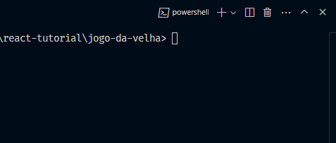
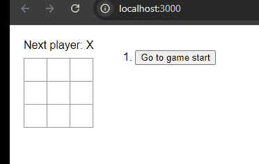

# Jogo da Velha com REACT

Esse é um projeto React então, para você conseguir rodá-lo na sua máquina, é preciso alguns pré-requisitos e passos.

1. Ter o Node.js instalado;
2. Certificar-se de que o terminal está olhando para a pasta do projeto;
3. Rodar o comando `npm start`;
4. Abrir no navegador o localhost na porta gerada pelo node.

---

## Rodando o comando no terminal:

---

## Jogando pelo LocalHost:

